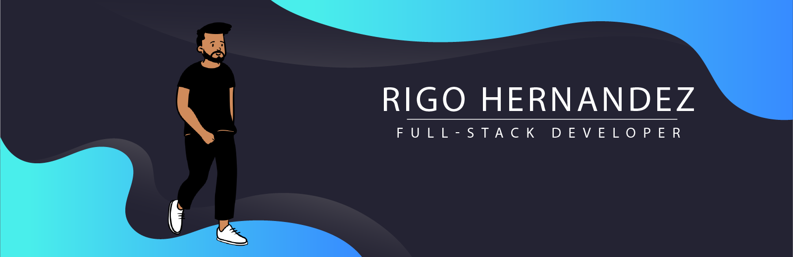

<h1 align="center">Hi 👋, I'm Rigo Hernandez</h1>
<h3 align="center">A Full-Stack Developer from Texas 🌵</h3>

  

- 🌱 I’m currently learning **Linux & JavaScript**

- 👨‍💻 My portfolio is available at [https://rigohernandez.dev](https://rigohernandez.dev)

- 📫 You can reach me at **hernandez_rigoberto@outlook.com**

<h3 align="left">Connect with me:</h3>

&nbsp;

